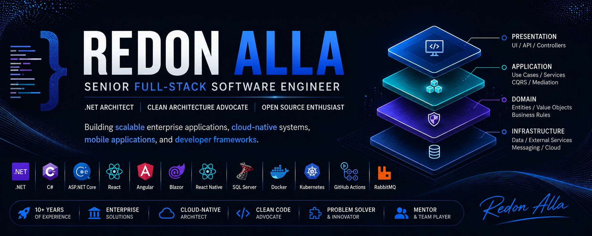

<h1 align="center">Hi, I'm Redon Alla</h1>

  <strong>Software Developer · .NET & React Native · Clean Architecture · AI-Assisted Workflows</strong> 
  Building scalable enterprise applications, cloud-native systems, mobile applications, and developer frameworks.

<!---

  
  
  

--->
  
---

## 🧑‍💻 About Me

I'm a Senior Full-Stack Software Engineer with 10+ years of experience designing, developing, and maintaining enterprise-grade software solutions.
My expertise spans backend development, frontend applications, mobile development, cloud-native solutions, and software architecture.

I am passionate about building systems that are:

* Scalable
* Maintainable
* High-performance
* Secure
* Developer-friendly

Throughout my career, I have worked on large-scale enterprise applications, contributed to banking systems, designed reusable frameworks, and mentored developers.

---

## 🛠️ Tech Stack

**Backend**

**Frontend**

**Architecture & Practices**

**AI & Tools**

---

## 💼 What I Do
I enjoy designing and building:

- Enterprise-grade backend systems
- High-performance REST APIs
- Cross-platform mobile applications
- Reusable developer frameworks
- Open-source tools and templates

My focus is writing clean, maintainable, scalable software that follows modern architectural principles.

---

## 💡 Engineering Principles

- Simplicity over complexity
- Clean code over clever code
- Automation over manual work
- Scalability from the start
- Maintainability as a feature
- Continuous learning
- Business value first

---

## 📊 GitHub Stats

  
  

---
<!--
## 🚀 Featured Projects

  
  
  
  
  
  

---

-->

## 🌱 Currently Learning
- Advanced Kubernetes
- Cloud-Native Architecture
- Platform Engineering
- AI Integration in Enterprise Applications

---

> "Great software is built through clean architecture, continuous learning, and attention to detail."
